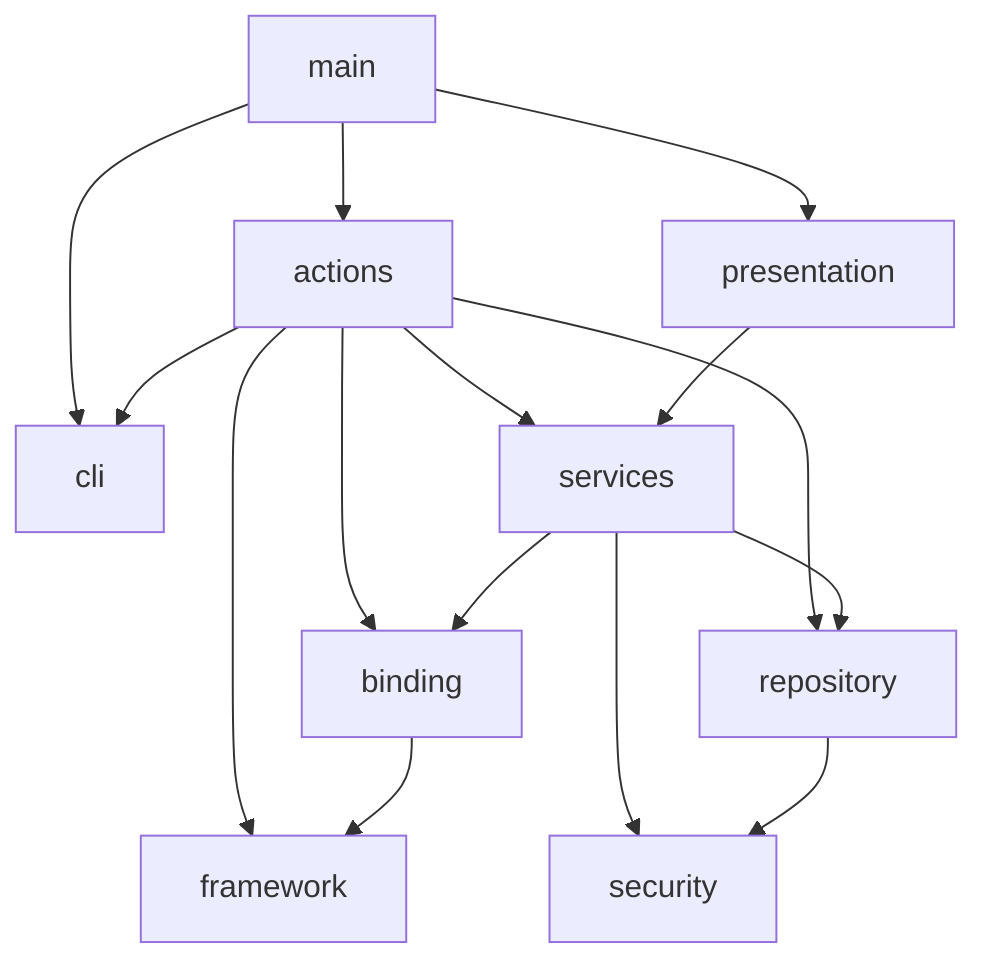

# ConfIt architecture

Borrowed from web layer architecture, with a few tricks to adapt it
to a CLI app.

## Layers

`cli` holds argument shapes alone. It parses `plan` and `status` plus
their flags.

`actions` holds orchestration flows. Each flow gathers data
through services and returns outcome data.

`services` hold transformation logic. Effects run through injected
seams, with every effect arriving as a parameter.

`repository` is the persistence seam. All disk touch passes through
it.

`binding` evaluates the Lua profile into a tool graph.

`framework` holds the Lua-facing API surface. Profiles script
against it while `binding` runs it, so the API versions apart from
the runner.

`presentation` turns outcome data into every string the user sees.

`model` holds the shared vocabulary. `state` covers everything
generated from Lua and applied. `dto` holds transfer shapes owned by
no single domain. Every layer reads them from here, so the call graph
stays a DAG.

`error` carries the crate error type. Every layer reports through it.

`main` parses, calls one action, hands the result to presentation,
prints.

## Dependency map

Every layer reads `model` vocabulary and reports through `error`, so
those edges stay out of the picture. Hashing reads through `security`
the same way. What remains above is the call flow.

`model` depends on zero layers. `cli` holds argument
shapes alone.

Structured change updates carry both old and new values.
Additions carry new alone. Removals carry old alone. Text and header
lines carry the body as the key.

State lives in `model`, beside the entities composing it. It loads
through `repository` traits.
