# Apply

`confit apply SOURCE` carries one desired plan to disk through a
guarded sequence. The source decides the load path. Every path
shares the preview, the prompts, the write order, plus the hook
run. The flow reads:



### Profile source

`confit apply PROFILE` evaluates a profile path. Tilde expansion
runs first across the source plus the shared flags. A missing
profile file fails naming the path:

```
apply reads no profile '{path}'
```

Evaluation runs through the engine under the shared flags. The
fixed slot loads as the previous plan. The build fills hashes
plus sorts documents by path. The preview renders.

### Bundle source

A source carrying the `.cb` suffix loads as a bundle file. The
suffix match reads case-insensitive. The archive hydrates from
its own bytes alone, so the run stands free of profiles. Stored
hashes read trusted, so the run renders nothing. This branch
moves from load straight to prompts. The fixed slot still loads as the
previous plan, plus prompts still guard the writes.

### Named slot source

`confit apply @name` loads one named slot from
`plans/{name}.json`. An absent slot fails with the command name
up front:

```
apply: '@name' reads absent
```

Slot names hold one file stem. The preview renders. Every slot
failure carries the `apply:` prefix.

### History source

`confit apply %N` loads one history entry. Picks start at one
with newest-first order, so `%1` names the just-previous entry.
A malformed pick fails naming the shape:

```
apply: '{raw}' reads unsupported, want '%N' holding a number from 1
```

An out-of-range pick fails naming the stored count:

```
apply: '{raw}' reads out of range, holding {total} stored plans
```

The preview renders. A past apply records a fresh history
entry, so history keeps moving forward.

### Preview

The preview renders the summary through the stderr print sender.
Lifecycle lines lead
the hooks section. Added hooks print `+` with full gates.
Changed hooks print `~` with slot diffs. Removed hooks trail
with `-`. Evaluated lines follow in plan order. Runnable hooks
print one resolved line each:

```
! run: /opt/tool --flag
```

Closed gates print skip lines instead. Requires speaks first,
when speaks second, passing checks speak third. Unresolvable
binaries fail the run naming the hook:

```
hook 'absent install' cannot resolve 'absent'
```

Document counts close the preview:

```
Documents: 1 to add, 0 to change, 1 to destroy.
```

While the fixed slot reads absent, the run counts as first. The
drift reference reads the desired plan, the order reads
disk-first, plus the preview frames impact as desired versus
disk. Past the first run the reference reads the previous plan
with recorded-first order.

### Prompts

The run prompts once before writing:

```
Apply these changes? Type 'yes' to continue:
```

Terminal runs print that line to stderr. Piped runs read the
answer line straight from stdin.
The run continues for the literal `yes` alone. `--force` skips this first
prompt. A fresh drift check runs before every write. Matching
snapshots proceed straight to disk. Differing snapshots print
fresh drift lines plus prompt again. Any other answer aborts the
run:

```
apply aborted: answer reads no 'yes'
```

Aborted runs leave disk plus slots plus history untouched.

### Write order

Documents write first in manifest path order, one branch per
kind:

- Text, structured, plus rc documents render through the core
  renderer.
- Opaque documents write raw blob bytes.
- Tree documents write each member to its joined path with
  per-member modes.
- Link documents land as symlinks.
- Modes land after bytes. Parents build on demand.

Recorded orphans delete next. Orphans hold state-recorded paths
missing from desired documents. Tree destinations stay out of
this pass. Dropped tree members delete after that. Members hold
recorded manifest entries missing from the desired manifest at a
kept destination. Hand-placed files stay put. Destinations stay
put.

The fixed slot writes next. Missing pool blobs land first, so
the stored manifest stays resolvable. The archive follows with
one fresh stamp entry plus rotation past five. Pool pruning
follows the archive, so a rotated-out entry releases its bytes
at once. Hooks run last, after files plus state plus history
land.

The report counts the run:

- `written` counts built documents.
- `removed` counts orphans plus dropped members.
- `stored` holds the fresh archive path.

### Hooks

Hooks run in plan order after the writes land. Changed gates
read the apply-start set. The first run holds every built path.
Later runs hold rewritten plus drift-touched paths, with tree
member drift mapping to the parent destination. Each run prints
its position:

```
hook 1 of 2: mise install
```

Hook output lands in the run log under that header line.

#### Eval order

Each hook passes three gates in order:

- `requires` holds capability. A closed gate warns plus moves on:

```
warn: mise install cannot run (in_path(mise))
```

- `when` holds need. A closed gate skips plus moves on:

```
skipped: mise install (no need: changed(dest))
```

- `checks` holds proof. Passing checks skip plus move on:

```
skipped: mise install (checks pass)
```

Open hooks spawn through the runner. The preview uses the same
order.

#### Merge rules

Hooks sharing argv plus path merge into one run. First-seen
order wins. Requires gates join with AND, flattening nested AND
branches. When gates join with OR, flattening nested OR
branches. An ungated side keeps the merged hook ungated on that
side. Checks concatenate. The timeout keeps the max. Single
hooks pass through untouched.

#### Timeout parsing plus kill

Profile timeouts read duration strings. Units read `h`, `m`, `s`
in that order, each holding at most once. A bare number reads as
seconds. The shape `1h10m10s` totals 4210 seconds. Omitted timeouts read
`10m`, backing 600 seconds. Bad values fail quoting the text.
The runner kills past the cap:

```
hook 'mise install' timed out after 600s
```

#### Signal death

Signal deaths read as exit code 1. The runner maps a missing
status code to 1 before comparing.

#### Nonzero

The runner treats a nonzero code as failure, naming the argv plus
the code:

```
hook 'mise install' failed with code 1
```

The failure aborts the rest of the hooks.

#### Still-failing abort

Post checks re-evaluate after each run. Passing checks prove the
work. Failing checks abort the rest naming the hook plus the
open gates:

```
hook 'mise install' failed checks after run: in_path(bat)
```

### Reports

Stdout carries the counts plus the archive path:

```
applied: 4 files, 1 removed
previous: {base}/previous/{stamp}.json
```

The preview plus drift lines plus prompts plus the spinner plus
the run log path land on stderr:

```
log: /tmp/confit-1234.log
```

The print sender runs on terminals, so piped runs skip preview
plus drift lines plus prompt text. The `log:` line lands on
stderr for failed runs too. Plan
errors print through the command wrapper with exit code 1:

```
confit: plan error: {message}
```
