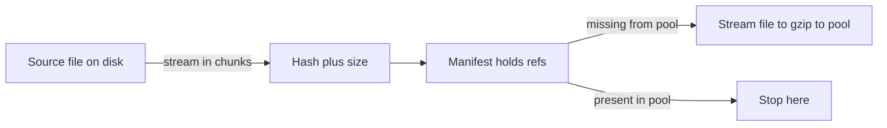

# ConfIt v0.8 design

Design spec behind v0.8.

Status: Sealed

## Motivation

v0.7 proved my real dotfiles plan plus apply clean on my laptop. Playing with it
surfaced a different problem, confit sometimes reports work it did not do.
A hook fires when nothing under it changed. A write into an old symlink reports
success while the bytes land somewhere the plan never named. A self-updating
binary reads as drift every single run. They are the report and the disk
disagreeing. v0.8 closes that gap, then closes the memory question with the
full pipeline behind it.

## Objective

What confit says happened matches what happened. A hook with nothing under it
changed stays quiet. A write through a stray symlink removes the link and leaves
whatever sat behind it alone, landing where the plan named. A binary marked
unmanaged reads as already in place while its bytes move under it. A patch path
counts the way the Lua beside it counts. Bytes live in files while memory holds
hashes, so the run peaks in the hundreds of megabytes instead of gigabytes.

## Goals

- Skip a hook when its named documents match the applied slot plus the disk, so
  an unrelated apply leaves fc-cache and mise install alone.
- Remove a pre-existing symlink before writing a plain document in its place, so
  an old dotfiles link reports the swap.
- Mark a document unmanaged when only its existence matters, so a self-updating
  binary reads as already in place.
- Count structured patch paths from 1, so `servers[1].host` names the first
  server the way the Lua around it does.
- Stop reading whole files into Lua strings before they ever reach Rust.
  Opaque documents take source paths, archive callbacks receive member paths
  from an extract-once temp root, and every consumer streams through blob
  refs, so the memory question closes with the full pipeline instead of one
  step.
- Preview with no destination writing nothing, so the safe path runs
  cheaper than the apply it previews, with explicit outputs minting
  slot plus file artifacts on purpose.

## Plan

### Hooks skip on no change

`confit.runtime.changed(path)` reads true when `path` differs between the
applied slot and the disk, and true unconditionally on a first run, since no
slot means no memory of anything. It composes inside `all` plus `any` the way
every other condition does:

```lua
config:add_hook(confit.hook.run({ "fc-cache", "-f", dest }, {
  when = confit.runtime.all({
    confit.runtime.in_path("fc-cache"),
    confit.runtime.changed(path),
  }),
}))
```

`path` names a document id, and document ids are paths that run long enough to
hide typos. `changed` validates its argument against the built document set at
plan time, a name matching nothing fails the plan naming the path, the same way
a missing apply profile does today. The check runs only against names that
resolve.

### Hooks answer three questions

While implementing the section above I noticed the gate lied. A hook with
nothing under it changed reported it could not run, but it could run
fine, it just had no need. One gate answered two questions, so the
report mixed inability with un-need. Hooks now answer three questions
in three slots, first closed mouth speaks. The first cut read slot
versus disk, but hooks run after files land, so a just-written document
reads clean. `changed` reads the preview instead, true while it shows
anything but already-in-place.

`requires` holds capability, the binary plus the environment the run
stands on. A closed requires warns the hook cannot run, and that line
stays honest because only inability closes it.

`when` holds need, true means run. `changed` lives here. A closed
when skips the hook naming the un-need instead of warning.

`checks` holds result proof, semantics unchanged. Passing checks skip
a hook whose work stands done, failing checks after a run abort.

The mise hook requires its binary, runs when its config changed, and
proves its shims. The fonts hook requires its binary and runs when
its tree changed, and proves nothing, since its outputs land where no
check reaches them:

```lua
config:add_hook(confit.hook.run({ "fc-cache", "-f", dest }, {
  requires = confit.runtime.in_path("fc-cache"),
  when = confit.runtime.changed(path),
}))
```

### Symlink write removes the link first

A write into a path that is a pre-existing symlink today reports success without
the manifest's bytes landing where the manifest named them, since the write follows the
link into whatever sits behind it. The exact mechanism stays
whatever the code currently does, the contract does not. Before a plain document
write lands, the backend checks the target path for a symlink. A hit unlinks it
first, leaving whatever sat behind the link completely alone, then writes the
fresh regular file in its place. The swap reports as a normal write, replacing
a link reads no different from replacing bytes.

Drift reads through the link for its content diff, so the preview shows
the real change. The preview names the link path though, not the file sitting
behind it, so a person reading the plan knows a link is about to go before apply
touches anything.

### Unmanaged documents

`confit.document.opaque` takes an `unmanaged` flag. Drift skips the sha
comparison
for an unmanaged document and checks existence alone. Present bytes read as
already in place no matter their content. Missing bytes read as a create and
come back from the declared content on the next apply, same as today. Quiet
docs render nothing, so unmanaged documents need no marker of their own.
A changed declaration rewrites once, disk movement alone never does.
Text documents take the same flag for parity.

```lua
kitty:add_document(confit.document.opaque(path, source, { unmanaged = true }))
```

### Patch paths count from 1

`servers[1].host` names the first server. `servers[0].host` fails the plan
naming the path, same shape as any other bad patch path today. The parser
changes in one spot, drift keys echo the same 1 based shapes back so a printed
key always matches what a person would type. `docs/book/src/spec/` and
`docs/book/src/manual/patch.md` carry 0 based examples today and move to 1 based in
the same pass, so every manual page matches the parser.

### Opaque documents read from disk

`confit.document.opaque` took content as bytes, which meant a profile
already read the whole file into a Lua string before `opaque` ever saw it. The
whole-run memory problem started there, at the source, before compression or
pooling or anything downstream got a chance to help. It takes a path
instead of content. Rust opens the source and streams it in chunks into hashes
plus sizes, so a font or a binary travels from source to plan as path strings
plus refs alone.

```lua
kitty:add_document(confit.document.opaque(path, source))
```

`source` names a file already on disk, a font, a binary, a downloaded asset.
`confit.document.compressed` plus `confit.document.tree` hand callbacks member
paths from the extract-once root instead of member bytes, and the section
below carries the rest of the pipeline from there.

### Bytes live in files, memory holds hashes

Source paths alone move the peak from Lua strings to Rust vectors. Holding
becomes referencing across the whole pipeline. Bytes live in exactly two
places, source files plus the blob pool, and everything else carries hashes,
sizes, plus paths.



A blob ref holds three facts, the content sha, the byte size from file
metadata, and the path of one materialized file. The pool is the single home
of bytes. Every consumer streams through the path and never holds the whole:
hashing reads in chunks, storing copies file to gzip to pool file, packing
streams into the bundle archive, writing streams pool file to destination.
Labels and progress read the inline size and never touch bytes.

The portable bundle file still embeds every blob, so any state reapplies from
the bundle alone with nothing beside it. Inside the process the blob map of
byte vectors becomes a map of refs. Reading a bundle file streams its blob
entries out to temp ref files and returns the manifest plus refs. Writing one
resolves each ref to bytes and gzips them per archive entry. The on-disk
bundle shape does not change, only the process stops holding it whole.


Assembly streams each declared source in chunks, records its sha plus size,
and emits the manifest. Lua holds path strings. Rust holds hashes. The opaque
call takes a source path. Root-relative sources resolve under the project
root, the way archives resolve today. Absolute sources resolve under the fetch
cache or the extract root, so a callback passes a member straight through as
opaque without loading a byte:

```lua
kitty:add_document(confit.document.opaque(path, source, { unmanaged = true }))
```

```lua
local binaries = confit.document.compressed(archive, function(name, info, path)
  if not name:match("%.ttf$") then return nil end
  return confit.document.opaque(dest, path)
end)
```

Archives extract exactly once into a fixed temp root keyed by archive hash, so
a reboot cleans it while near runs reuse it. Callbacks receive member paths,
never content strings, and kept members record refs to extracted files. One
archive byte crosses into Lua only when a callback asks for it.

```lua
local members = confit.document.tree(archive, dest, function(name, info, path)
  if not name:match("%.tmpl$") then return nil end
  local raw = confit.resources.load_text(path)
  return confit.document.text(rel, render(raw))
end)
```

Members take any document shape. A callback returns text, structured data, or
opaque per member, and untouched members never enter Lua at all. Raw bytes
reach Lua only through the on-demand loaders. The read jail admits three
zones, the project root, the fetch cache, and the extract root, checked the
same way. Sources plus loaders share those zones, so every path a callback
can name is a path it can use.

The previous state loads as manifest plus path refs with no byte reads.
Summary, counts, and the rewrite set run on hashes. Drift resolves recorded
bytes through refs and compares against disk reads, with no bundle bytes in
memory. The disk short-circuit and the unmanaged skip stay ahead of all of
it. Streaming file-hash comparison stays open work.

The resolve step could keep a contract like this:

```rust
struct BlobRef {
    sha: String,
    size: u64,
    path: PathBuf,
}

fn resolve(documents) -> Manifest {
    let mut manifest = Manifest::empty();
    for doc in documents {
        let file = open_stream(doc.source);
        let sha = hash_chunks(file);
        let size = file.metadata().len();
        manifest.push(BlobRef { sha, size, path: doc.source });
    }
    manifest
}

fn store(refs) {
    for r in refs.missing_from_pool() {
        gzip_copy(r.path, pool_file(r.sha));
    }
}

fn write(r, dest) {
    copy(pool_file(r.sha), dest);
}
```

The filesystem boundary grows streaming handles for reads plus writes, and the
memory fake answers through cursors over its map. Every backend plus fake
moves together.

### Bare plan previews, outputs mint

A plan run with no destination previews alone. It evaluates,
diffs, prints the summary, and stops. The default builds no
artifact, so the safe preview skips compression and runs
cheaper than the apply it previews. An explicit file output
builds the portable bundle, a named output fills the slot.
Cost follows intent: previewing hashes alone, minting
compresses.

The daily command stays apply with a profile, preview included.
Plan serves two narrower jobs:

- The preview. Home stays as found.
- The artifact minter for switching plus sharing plus backup.

Switching profiles rides named slots through the shared pool.
Sharing rides the portable file. Network fetch covers the odd
machine.
