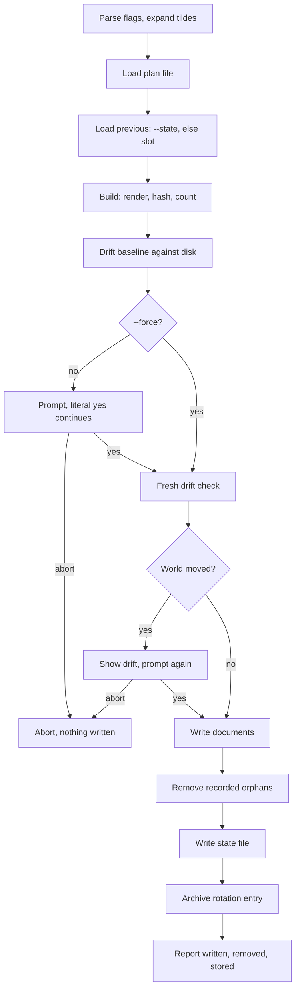

# Apply planned changes

`confit apply --plan FILE` runs on the file alone. Desired
documents come from the file. No preview renders here.

Only the literal `yes` continues. Other answers abort the run.
The fresh snapshot compares against the baseline. Drift
re-prompts only when fresh differs from baseline. `--force`
skips the first prompt, while drift still re-prompts.
Writes land per kind: text plus structured through render,
opaque as raw bytes, links as symlinks, parents on demand.
Orphans mean state-recorded paths absent from desired
documents. Deletes cover those paths. Rotation keeps the
newest five bare plans.

Stdout carries `applied:` plus `previous:` through anstream.
Stderr carries prompts plus drift lines plus the spinner plus
the `log:` path. The drift lines and prompts land on stderr
through the seams output; the report lands on stdout.
