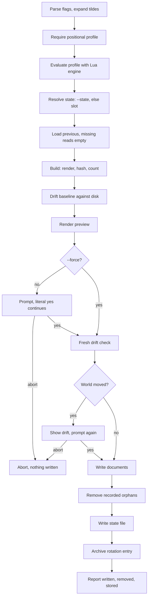

# Apply without a plan

`confit apply [PROFILE]` evaluates first, then follows
the same guarded write path. The profile rides positionally,
required unless `--plan` passes. The preview renders for review
on the spot.

`--plan FILE` runs instead on the file alone with no profile
and no preview; see apply-plan.md. That branch sets preview
to false and skips the preview render.

Apply always writes the state file: explicit `--state` wins,
else the fixed slot records the result. The machine owns the
result after every apply. The next plan reads the slot and
shows zero changes while disk matches. Switching profiles
converges through the same slot: last applied wins, orphans
from the earlier profile delete.

Stdout carries `applied:` plus `previous:` through anstream.
Stderr carries the preview plus prompts plus the spinner plus
the `log:` path. The preview and drift lines land on stderr
through the seams output; the report lands on stdout.
