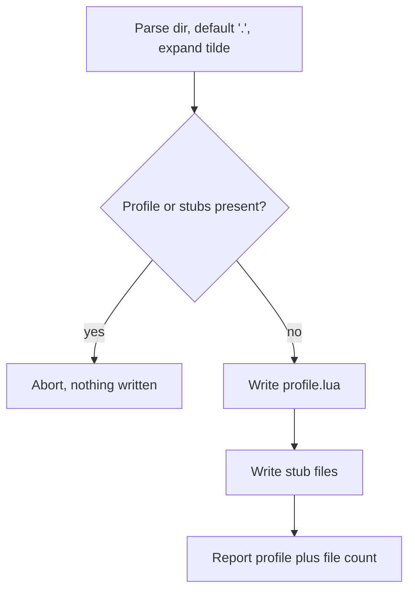

# Scaffold a project

`confit init [DIR]` scaffolds one profile plus stubs in the
target folder. The dir defaults to the current folder.

Present profiles or stubs abort with nothing written, naming
the path holding the clash. The scaffold holds one profile
plus editor stubs beside it. Stubs mirror the plugin load
layout beside their plugin names.

Stdout carries the `init:` line with the profile path plus
the written file count through anstream. The run uses no
prompts, no preview, and no spinner, and prints no `log:`
line.
