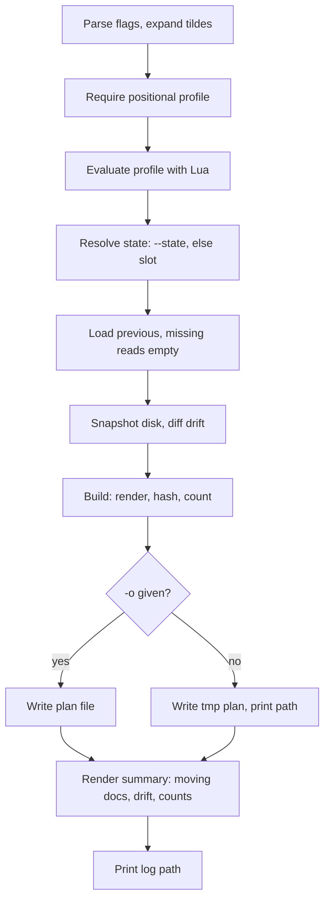

# Plan changes

`confit plan PROFILE` previews through reads alone. The profile
rides positionally. Stdout holds the diff. The payload lands in
a file.

Evaluate runs the profile through the engine. State resolves to
the explicit file or the fixed slot at `state.json`. Missing state
reads empty, so first runs show everything as add. Drift compares
recorded documents against disk bytes. Build renders plus hashes
every document and counts create, update, delete against previous.
The summary prints creates, updates, deletes, drift notes, plus
counts. The tmp path serves
later `--plan` plus `--state` reuse.

Stdout carries the summary plus the `plan:` path through
anstream. Stderr carries the spinner plus the `log:` path.
Prompts never appear here: plan writes no documents.
