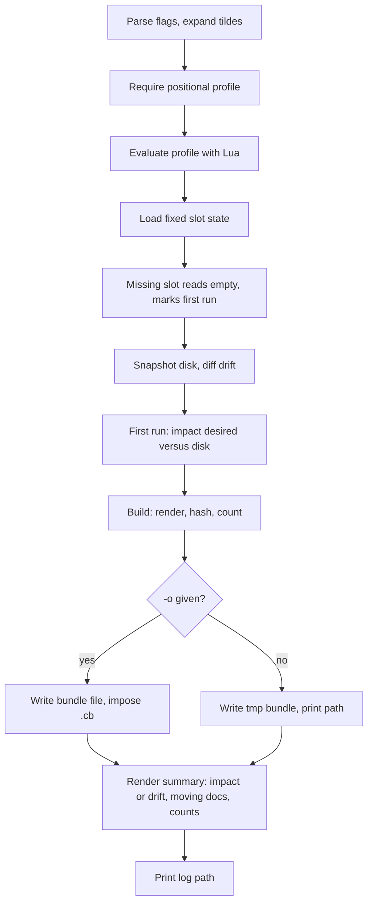

# Plan changes

`confit plan PROFILE` previews through reads alone. The profile
rides positionally. Stdout holds the diff. The payload lands in
a bundle file.

Evaluate runs the profile through the engine. State reads the
fixed slot at `state.json`. Missing state
reads empty and marks the first run, so the plan diffs desired
documents against disk bytes. Disk-identical paths read as
already in place, disk-differing paths read as overwrites the
apply will replace. Drift compares recorded documents against
disk bytes past the first run. Build renders plus hashes
every document and counts create, update, delete against previous.
The summary prints creates, updates, deletes, drift or impact
notes, plus counts. The tmp path serves
later apply reuse. An `-o` path gains `.cb` when missing.
`@name` stores a named slot instead of a file.

Stdout carries the summary plus the `plan:` path through
anstream. Stderr carries the spinner plus the `log:` path.
Prompts stay out of plan runs. Plan writes no documents.
