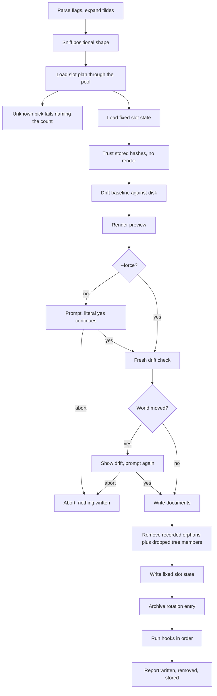

# Apply the past

`confit apply %N` re-applies one history entry newest-first
from one. `confit apply @name` re-applies one named slot.
Both run the standard apply flow with preview plus prompts.
Applying the past is apply with older desired documents.

Picks count newest-first from one, so `%1` names the
just-previous entry. A past apply records a fresh rotation
entry like any other apply, so history keeps moving
forward. Applying the past restores exactly what the
stored plan holds.

Stdout carries `applied:` plus `previous:` through anstream
for a picked slot. Stderr carries the preview plus prompts
plus the spinner plus the `log:` path. The preview and
drift lines land on stderr through the seams output; the
report lands on stdout.
