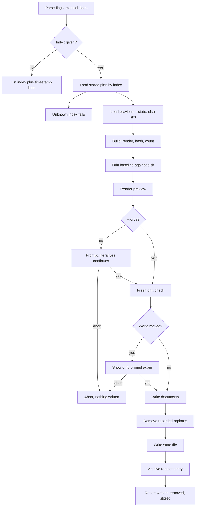

# Rollback

`confit recover` lists stored plans. `confit recover INDEX`
re-applies the picked one through the standard apply flow.
Rollback is apply with older desired documents.

The listing shows `index @ timestamp` lines, oldest first.
Unknown indices fail naming the range. A recovered apply
records a fresh rotation entry like any other apply, so
history keeps moving forward. Recovery restores exactly what
the stored plan holds.

Stdout carries `applied:` plus `previous:` through anstream
for a picked index. Stderr carries the listing lines plus the
preview plus prompts plus the spinner plus the `log:` path.
The listing, preview, and drift lines land on stderr through
the seams output; the report lands on stdout.
